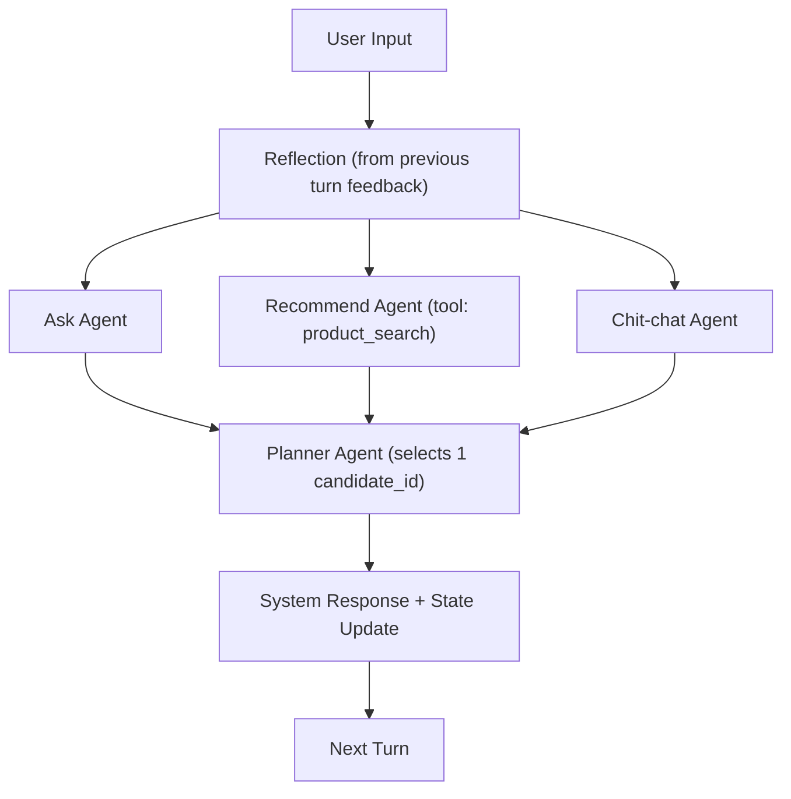

# macrs-ecom-recommender

Production-minded implementation of a **MACRS-style** (Multi-Agent Conversational Recommender System) e-commerce assistant.

**What is MACRS?**  
MACRS (Multi-Agent Conversational Recommender System) is a framework that coordinates multiple specialized responder agents (ask / recommend / chit-chat) with a single planner and a user feedback-aware reflection mechanism. It emphasizes **dialogue policy quality**—deciding *when* to ask, recommend, or engage—over pure ranking accuracy.  
Reference paper: [A Multi-Agent Conversational Recommender System (MACRS)](https://arxiv.org/abs/2402.01135).

## Demo
[Demo](/demo.gif)

This repo implements **auditable multi-agent systems** with:
- parallel candidate generation (Ask / Recommend / Chit-chat) every turn
- a single authoritative **Planner** that selects exactly one dialogue act + response
- **user feedback-aware reflection** that updates memory and strategy guidance (not raw prompt hacking)
- an external (non-LLM) retrieval/ranking layer (RAG) for product candidates

---

## What This Implements (Paper Alignment)

| MACRS Component | This Repo |
|---|---|
| Multi-agent responder generation | `AskingAgent`, `RecommendingAgent`, `ChitChatAgent` run every turn |
| Planner selects one act/response | LLM Planner chooses by `candidate_id`, does not rewrite responses |
| Information-level reflection (`π_info_reflect`) | Updates `user_profile` + `browsing_history` from user feedback |
| Strategy-level reflection (`π_stra_reflect`) | On recommendation failure, generates per-agent suggestions + planner corrective experiences |
| External recommender | PostgreSQL + pgvector + full-text hybrid search in `scripts/retrieve.py` |

---

## System Architecture

### Control Flow (One Turn)



### Key Design Principles

- **All agents run every turn** (parallel ideation). Agents never talk to each other.
- **Planner is the only authority**: selects exactly one candidate; does not rewrite.
- **Reflection updates memory + guidance**:
  - user profile and browsing history
  - strategy suggestions to responders
  - corrective experiences to the planner
- **Recommendations are tool-grounded**: the Recommending Agent must use `product_search`.

---

## Memory Model (What the System Remembers)

| Field | Purpose | Where |
|---|---|---|
| `user_profile` | Structured preferences (key-value) inferred from user feedback | `macrs/state.py` |
| `browsing_history` | Items/attributes mentioned by the user to avoid duplication | `macrs/state.py` |
| `dialogue_history` | Recent user/system messages (+ act) for context and repetition avoidance | `macrs/state.py` |
| `agent_suggestions` | Strategy-level suggestions for Ask/Rec/Chat after failures | `macrs/state.py` |
| `corrective_experiences` | Planner memory of “what to do next time” after failures | `macrs/state.py` |

Important: information-level reflection is instructed to **only add preferences the user stated or confirmed** (to avoid contaminating the profile with assistant-made suggestions).

---

## Agents (Responder Modules)

| Agent | Goal | Hard Constraints (MACRS-style) | File |
|---|---|---|---|
| Asking | Max information gain via preference elicitation | No recommendations, avoid repeated questions | `macrs/agents/ask.py` |
| Recommending | Recommend ranked items from external system | Must use `product_search`, no invented products | `macrs/agents/recommend.py` |
| Chit-chat | Keep user engaged and elicit soft signals | No product listing, no direct preference Qs, no recommendation | `macrs/agents/chitchat.py` |

### Candidate Interface
All responder agents output structured candidates (not free text), e.g.:

```json
{
  "agent_name": "recommending",
  "act": "recommend",
  "confidence": 0.9,
  "candidates": [
    {
      "candidate_id": "cand1",
      "response": "Here are a few options...",
      "slots": {"category": "dress"},
      "products": [{"id": "…", "title": "…"}]
    }
  ]
}
```

---

## Planner (Dialogue Act Selection)

The Planner performs multi-step reasoning over:
- `dialogue_history` and `act_history` (avoid repetition)
- `user_profile` sufficiency (recommend now vs ask more)
- `corrective_experiences` (avoid repeating prior mistakes)
- the full content of candidate responses (and product metadata for recommend candidates)

The Planner selects by `candidate_id`, and the selected response is returned verbatim.

File: `macrs/planner.py`

---

## Reflection (User Feedback-Aware)

Reflection operates at two levels:

1. **Information-level**: infer preferences from the user’s feedback and update `user_profile` and `browsing_history`.
2. **Strategy-level**: only when a recommendation fails, generate:
   - suggestions for Ask/Rec/Chat (`agent_suggestions`)
   - corrective experiences for the Planner (`corrective_experiences`)

This repo uses an LLM-based failure detector to decide whether the last recommendation failed, then triggers strategy reflection.

File: `macrs/reflection.py`

---

## Retrieval / RAG Layer (External to the LLM)

Products are ingested into PostgreSQL with pgvector embeddings and a full-text `tsv` index.
Retrieval is hybrid:
- dense vector similarity (`pgvector`)
- sparse full-text ranking (`ts_rank_cd`)

Files:
- `scripts/ingest.py` (CSV → Postgres + embeddings)
- `scripts/retrieve.py` (hybrid search)

---

## Project Layout

| Path | What |
|---|---|
| `macrs/orchestrator.py` | LangGraph orchestration (fan-out → planner) + state finalize |
| `macrs/agents/` | Ask / Recommend / Chit-chat responder agents |
| `macrs/planner.py` | LLM-based planner selection |
| `macrs/reflection.py` | Info-level + strategy-level reflection |
| `macrs/state.py` | Conversation state and memory |
| `scripts/chat.py` | Interactive CLI chat app |
| `scripts/smoke.py` | Single-turn smoke runner |
| `scripts/ingest.py` | Product ingestion |
| `scripts/retrieve.py` | Hybrid product retrieval |
| `langgraph.json` | LangGraph dev/studio config |

---

## Running Locally

### 1) Environment Variables

| Variable | Purpose |
|---|---|
| `DATABASE_URL` | Postgres DSN for product DB |
| `GROQ_API_KEY` | Groq API key for `ChatGroq` |
| `MACRS_LLM_MODEL` | LLM model name (default: `openai/gpt-oss-20b`) |
| `MACRS_USE_LLM` | Set to `0` to disable LLM calls (test mode) |

See `.env.example`.

### 2) Ingest Products

```bash
python scripts/ingest.py products.csv
```

### 3) Chat (CLI)

```bash
python scripts/chat.py
```

---

## LangGraph Dev / Studio

```bash
source .venv/bin/activate
langgraph dev --config langgraph.json --no-browser
```

---

## Engineering Notes (Why This Is “Multi-Agentic”)

This repo is intentionally built to demonstrate production-like multi-agent patterns:
- strict structured outputs (schema-first)
- tool-grounded recommendation (no hallucinated items)
- an explicit planner with auditable inputs
- memory and reflection as first-class modules
- deterministic graph topology with parallel node execution

---

## Roadmap (Evaluation & Ablations)

Planned MACRS-style evaluation:
- recommendation: Recall@K, NDCG@K
- conversation: turns-to-success, success rate
- strategy: act distributions and transitions
- ablations: no reflection, no planner (static), single-agent baseline

---

## License
No license. This is just for education purposes only.
